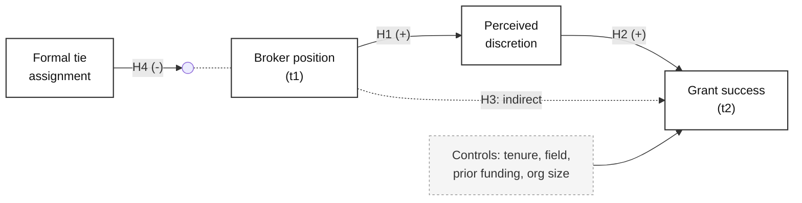

# Theory Graph Master

> Shared workspace: [../academic-master/references/workspace.md](../academic-master/references/workspace.md).


## 语言 / Language

**用户用中文提问，就全程用中文回答**，包括追问、表格标题、图表标注和写进文件的正文。
用中文学术语体直接写，不要先用英文构思再翻译。术语对照表和因果表述的中文阶梯见
[LANGUAGE.md](../../LANGUAGE.md)。这条规则优先于本文件里的其他格式约定。

Reply in the language the user wrote in. Full policy and the EN/中文 terminology
table: [LANGUAGE.md](../../LANGUAGE.md).

Two different pictures get called "the model" and they do different jobs. Getting this wrong is the most common figure mistake in social science:

| | **Conceptual framework** | **Causal DAG** |
|---|---|---|
| Answers | What does my theory claim | What must I adjust for |
| Contains | Constructs, hypothesized paths, H labels, signs | Every variable including the unmeasured ones |
| Omits | Confounders you are not theorizing | Nothing that matters causally |
| Lives in | The theory section | The methods section, or an appendix |
| Judged by | Does it match the hypotheses | Is the effect identified |

**Ask which one the user needs before drawing.** If they want both, draw the framework first — it is the theory — then derive the DAG from it and let the DAG reveal what the framework quietly assumed away.

## Modes

| Mode | Output |
|---|---|
| `framework` | Conceptual model: IV → mediator → DV with moderators, control blocks, H labels |
| `dag` | Causal DAG plus a written identification memo |
| `path` | SEM measurement and structural path diagram with loadings |
| `prisma` | PRISMA 2020 four-stage flow with the counts |
| `codetree` | Qualitative coding hierarchy, or the Gioia data structure |
| `timeline` | DiD, event study, panel or process timeline |

---

## Mode: framework

### Step 1 — extract the structure

Get the user to name every element. Do not draw from a vague description; a wrong figure is harder to fix than a blank page. Ask for what is missing:

- **Independent variables** — what does the theory say does the causing
- **Dependent variables** — what changes
- **Mediators** — the through-what. Each mediator implies **two** paths, a → m and m → b, and both need a hypothesis
- **Moderators** — the when-and-for-whom. A moderator arrow points **at a path**, never at a box. This is the single most common drawing error
- **Controls** — grouped in one box, not drawn as individual arrows, or the figure becomes unreadable
- **Level of analysis per construct** — a cross-level model needs the levels shown as bands, or the figure hides its own hardest problem
- **Sign and hypothesis number** on every path: `H2a (+)`

### Step 2 — validate before rendering

Run these and report what fails. Silently drawing a broken model is worse than not drawing:

1. **Every path has a hypothesis, every hypothesis has a path.** Mismatches are the most common reviewer catch.
2. **Every mediator has both legs.** A mediator with only one arrow is a control variable in a costume.
3. **Every moderator lands on a path.** If it lands on a box it is an IV, and the text should say so.
4. **No unlabeled construct.** "Other factors" is not a construct.
5. **DV is not measured with the same instrument as the IV**, or common method variance is a figure-level problem, not a limitation.
6. **Direction of every arrow is defensible.** For each one ask whether the reverse is equally plausible. If it is, say so in the note.
7. **No path that is true by definition.**

### Step 3 — render

Default to **Mermaid** — it needs nothing installed and renders in chat, in artifacts, and on GitHub. Move to Python or R when the user needs a file for a journal.



For a file, use `scripts/render_framework.py` — it takes a JSON spec and writes SVG, PNG at 300 dpi and PDF, greyscale-safe, from one source. See [references/rendering.md](references/rendering.md) for the spec format and for the R and Stata paths.

### Step 4 — the figure note

Every figure ships with a note, and the note is not optional. Template in [references/figure-conventions.md](references/figure-conventions.md):

> *Figure 1.* Conceptual model. Solid arrows are hypothesized direct effects; the dashed arrow is the hypothesized indirect effect. The moderator terminates on the path it conditions. Control variables are modelled but not hypothesized. Hypothesis numbers and expected signs are shown on each path.

---

## Mode: dag

A DAG is not decoration. It is how you find out which controls help and which ones actively create bias.

1. **List every variable**, including the ones you cannot measure. Mark unmeasured ones with a dashed border or a `U` prefix — they are the point of the exercise.
2. **Draw an arrow wherever a direct causal effect is plausible**, even weakly. Omitting an arrow is a strong claim of no effect; including one is cheap.
3. **Find every backdoor path** from exposure to outcome.
4. **Compute the adjustment set** and report it. Rules and worked examples in [references/dag-rules.md](references/dag-rules.md).
5. **Flag the two errors that make things worse**: adjusting for a collider opens a path that was closed, and adjusting for a mediator removes part of the effect you are trying to estimate.
6. **Write the identification memo** — the adjustment set, what is unmeasured within it, and what that means for the claim.

Verify rather than eyeball it:

```r
library(dagitty)
g <- dagitty('dag {
  X [exposure]  Y [outcome]  U [latent]
  U -> X   U -> Y   X -> M   M -> Y   Z -> X   Z -> Y   X -> C   Y -> C
}')
adjustmentSets(g, exposure = "X", outcome = "Y")     # what to control for
impliedConditionalIndependencies(g)                  # testable implications
```
```python
# uv run --with networkx --with matplotlib scripts/render_dag.py spec.json
```

If the adjustment set is empty because a required confounder is unmeasured, **say the effect is not identified** and hand back to [method-master](../method-master/SKILL.md) for a design that does identify it. That sentence is the whole value of drawing the DAG.

---

## Mode: path

SEM diagrams have their own grammar and reviewers in psychology and management read it strictly: **latent variables are ellipses, observed variables are rectangles, errors and disturbances are small circles or bare arrows, single-headed arrows are regressions, double-headed arrows are covariances.**

Report standardized loadings on the measurement paths and standardized coefficients with significance on the structural paths. Include the fit indices in the note: chi-square with df and p, CFI, TLI, RMSEA with its 90 percent CI, SRMR.

```r
lavaan::sem(model, data = df) |> lavaanPlot::lavaanPlot(coefs = TRUE, stand = TRUE)
# or semPlot::semPaths(fit, whatLabels = "std", layout = "tree2")
```
```stata
sem (Trust -> t1 t2 t3) (Perf -> p1 p2 p3) (Perf <- Trust), standardized
estat gof, stats(all)
* Stata draws SEM in the Builder GUI; for a scripted figure, export the
* coefficients and render with scripts/render_framework.py
```

---

## Mode: prisma

Take the counts from `.research/projects/<slug>/screening.csv` or from the user, and render the four stages: identification, screening, eligibility, included. Every exclusion at full-text stage needs a reason with its count — that is the part reviewers check.

Mermaid template in [references/rendering.md](references/rendering.md). R alternative: `PRISMA2020` package, which takes the counts and emits an interactive or static flow.

---

## Mode: codetree

For thematic or grounded analysis: codes → categories → themes, with the count of sources and excerpts per node so the reader can see where the weight sits.

For the **Gioia data structure**, the convention is three columns left to right: 1st-order concepts in informant language, 2nd-order themes in researcher language, aggregate dimensions. Reviewers in management expect exactly this layout; do not improvise a different one.

---

## Mode: timeline

For DiD, event studies, panel designs and process tracing: time on the horizontal axis, units or groups stacked, treatment timing marked, observation windows shaded, and the pre-period made visibly long enough to support the parallel-trends claim. If the design has staggered adoption, **show the stagger** — a single treatment line hides the estimation problem described in [method-master's identification notes](../method-master/references/causal-identification.md).

---

## Hard rules

1. **用中文提问就用中文回答**，全程，包括表格和图注。术语见 [LANGUAGE.md](../../LANGUAGE.md)。Reply in the language the user wrote in.
2. **Ask framework or DAG before drawing.** They are different objects.
3. **Moderators terminate on paths, not on boxes.**
4. **Never render a model that failed validation** without reporting the failure first.
5. **Greyscale-safe always.** Encode with line style and shape, never with color alone. Journals still print in black and white and reviewers read printed copies.
6. **Every figure gets a note** defining every element.
7. **Vector for submission** (SVG, PDF or EPS); PNG only at 300 dpi or higher and only when the journal demands raster.
8. **The figure must match the hypotheses in the text.** Check it, every time, and say you checked.
